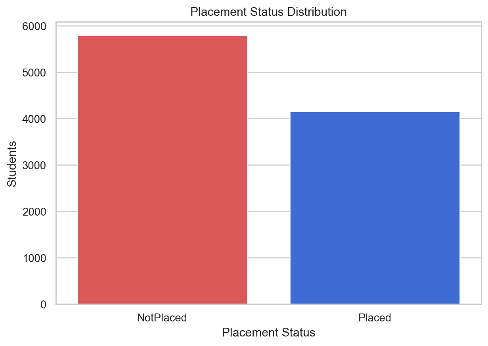
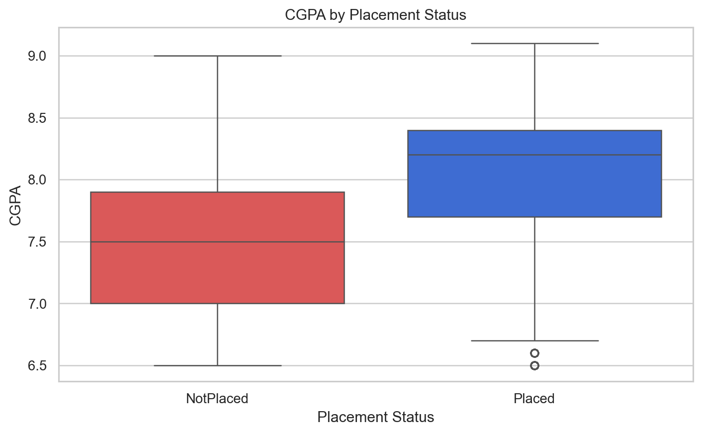
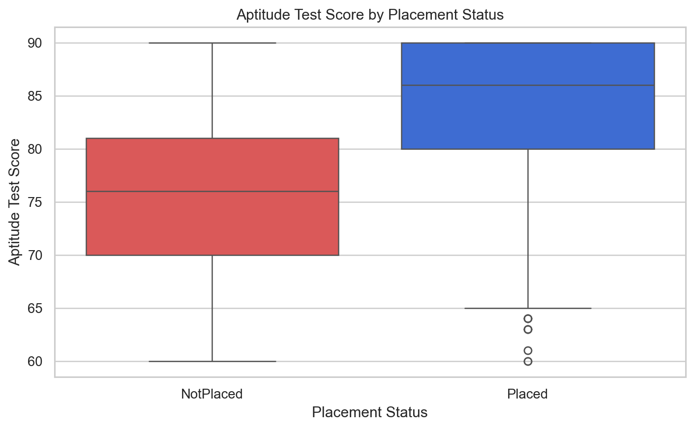
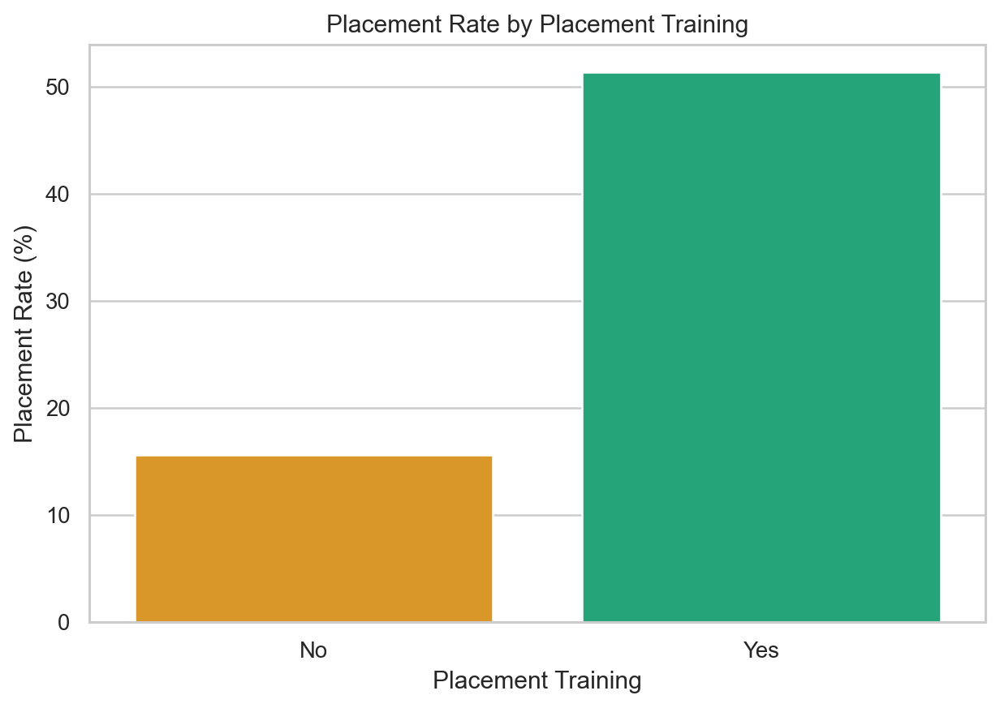
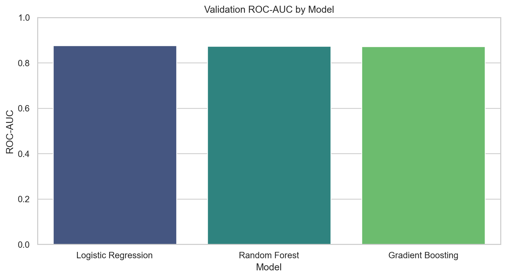
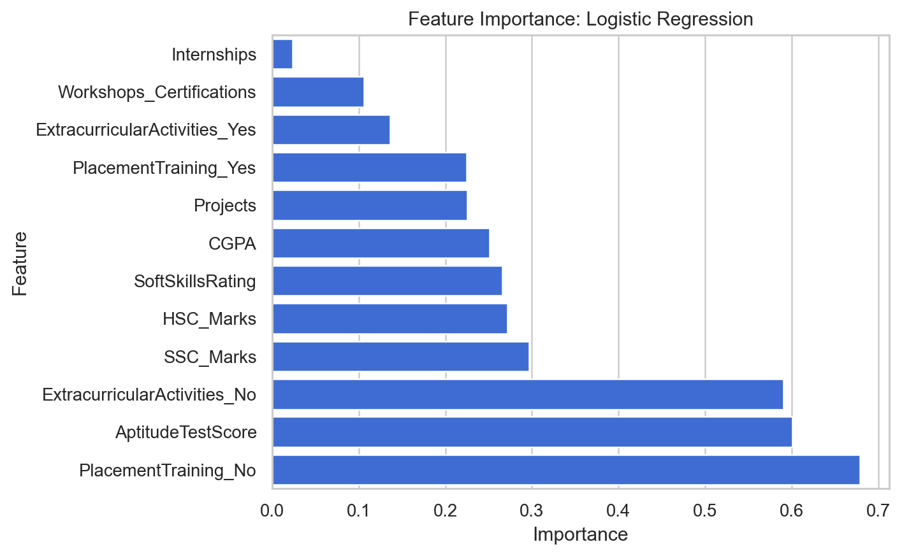

# Student Employability Prediction Using Machine Learning

## Project Overview

This portfolio case study analyzes student academic and skill indicators to predict whether a student is likely to be placed or not placed. It demonstrates a complete analytics workflow for education, training, career services, and employability-readiness programs.

The public repository is a presentation version. It shows the business problem, methodology, model comparison, visual analysis, and final results without publishing the reusable training pipeline, raw data, processed data, trained model, or prediction utility.

## Business Questions

- Which academic and skill-related factors are most related to placement?
- Do CGPA, internships, projects, aptitude scores, and soft skills affect employability?
- Does placement training improve placement chances?
- Which model performs best for placement prediction?
- Which features should be highlighted in a student readiness dashboard?

## Dataset

The project uses a public Campus Recruitment CSV dataset from Hugging Face Datasets. The data includes academic, skill, training, and placement outcome fields.

More details are available in [data_sources.md](data_sources.md).

## Methodology

The private implementation includes data loading, cleaning, target preparation, exploratory analysis, feature engineering, model training, model comparison, and validation.

The public version keeps only the client-facing outputs: figures, summary tables, executive report, and a structured notebook summary.

## Key Results

- Records analyzed: 9,957
- Target: Placement status
- Placement rate: 41.73%
- Best model: Logistic Regression
- Validation accuracy: 80.00%
- Validation F1-score: 76.37%
- Validation ROC AUC: 87.58%

## Visual Outputs

### Placement Status Distribution



### CGPA by Placement Status



### Aptitude Score by Placement Status



### Placement Rate by Training



### Model Performance Comparison



### Feature Importance



## Portfolio Contents

```text
notebooks/
  student_employability_case_study_summary.ipynb

reports/
  executive_report_ar.md
  figures/
  tables/

data_sources.md
```

## Important Note

This repository is a public portfolio presentation. It intentionally excludes raw data, processed data, trained model artifacts, reusable scripts, and prediction utilities. A full implementation is delivered privately as part of a paid client project.
